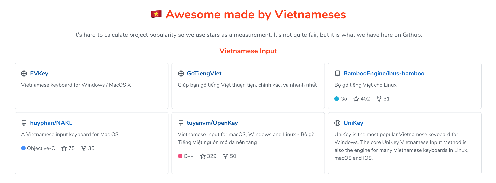

# 🇻🇳 Awesome made by Vietnameses  
 

A collection of amazing applications or open source projects built by Vietnamese developers

[Homepage](https://awesome-vietnamese.anhthang.org)

## 🏗 Contributing

It's hard to calculate project popularity so we use stars as a measurement. It's not quite fair, but it is what we have here on Github.

If you want to add project to this list, please, make sure that:

- The project was created by the developers born in Vietnam
- The project can't be just an experimental or sample project
- The project has more that **100 stars** on Github
- If they do, feel free to make a PR!

## 🥰 Thanks

- Inspired by [🇧🇷 awesome-made-by-brazilians](https://github.com/felipefialho/awesome-made-by-brazilians)
- Contributors

## 📝 License

[MIT](/license)
